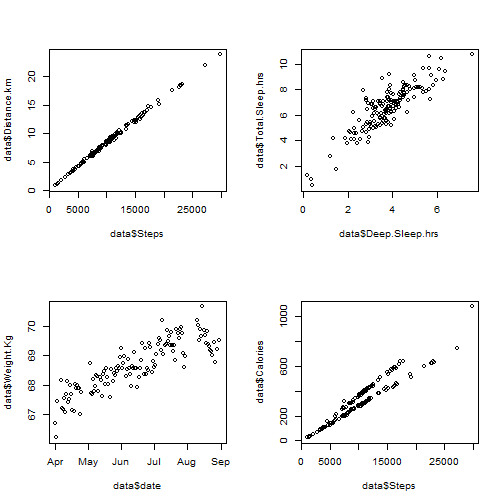
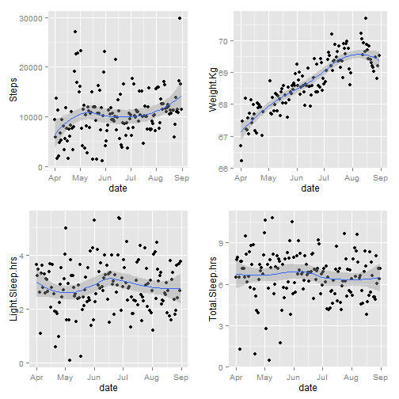
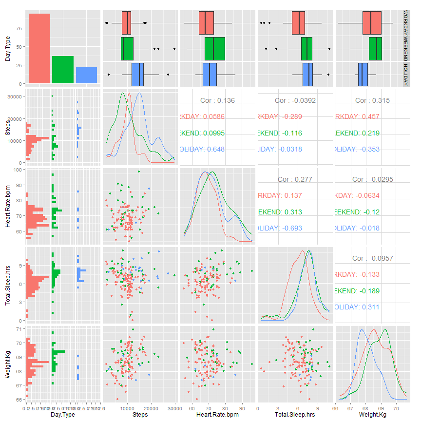

Analysis of the data generated by Withings Activite Watch and Smart Scale
========================================================
transition: rotate 
width: 1440
height: 900
font-family: 'Risque'

author: f4data
date: Sun Sep 27 17:47:01 2015


Introduction
========================================================
Due to the increasing popularity of tracking devices the author decided to track himself and gather data for 5 months (2015-04-01 to 2015-08-31) and have an insight in the data. Usually the life style (sleep patterns, activity) is different between working days, weekends and holidays. The **goals** are:
- observe the relationship between variables
- observe the behaviour along the time
- observe differences in behaviour in those types of days

The **sources of the data** are the Withings products ([www.withings.com](http://www.withings.com))
- Withings Activite Watch: tracks activity (steps, calories, distance walked/run) and sleep (light sleep, deep sleep, wake up times in the night, awake time - lying in bed but not sleeping).
- Withings Smart Scale: tracks weight (weight in Kg, fat mass), heart rate (beats per minute). It tracks also air quality and temperature but that information cannot be downloaded yet.


Relationship between variables
========================================================
After observing the relationship between the variables, there are several linear correlations between the following variables:
- Steps ~ Distance.km: kind of obvious
- Deep.Sleep.hrs + Light.Sleep.hrs ~. Total.Sleep.hrs: obviously as the total time is an addition of them both
- Weight ~ Date: the weight increases with the time

Interesting observations:
- Calories vs Steps and Distance.km: although they are linear 2 linear relationships can be observed. That would explain that the device is able to differentiate between the speed of the steps.

***


```r
par(mfrow=c(2,2))
plot(data$Steps, data$Distance.km)
plot(data$Deep.Sleep.hrs, data$Total.Sleep.hrs)
plot(data$date, data$Weight.Kg)
plot(data$Steps, data$Calories)
```

 
Behaviour along the time
========================================================
 

***
It can be observed that:
- the number of Steps started very low (lack of practice), remained stable for a long time around 10.000 Steps/day (recommended amount by WHO )
- there is a weight gain of about 3 Kg in the period analyzed, but in August, where the steps increased, the weight decreased as well
- the light sleep fluctuates being lower in the month of May and higher in the month of June, most likely due to the high temperatures
- however the total sleep amount remained stable, where the light sleep decreased, the deep sleep increased.

Relationship between types of days
========================================================

Just the main variables will be taken:
- Steps: on holidays is when I walked more, around 15000 steps while on the weekends I walked around 8000, less than on working days.
- Heart rate: on the weekends is a bit higher. It could be because on the weekends I measured myself later on the day.
- Total sleep: on working days the sleep time is a bit less than 7h while on holidays and weekends is beyond 7.5 hours.
- Weight: it shows us that the holidays are not equally distributed on time and shows that on the weekends many times I weighted myself after having breakfast.

***
 
